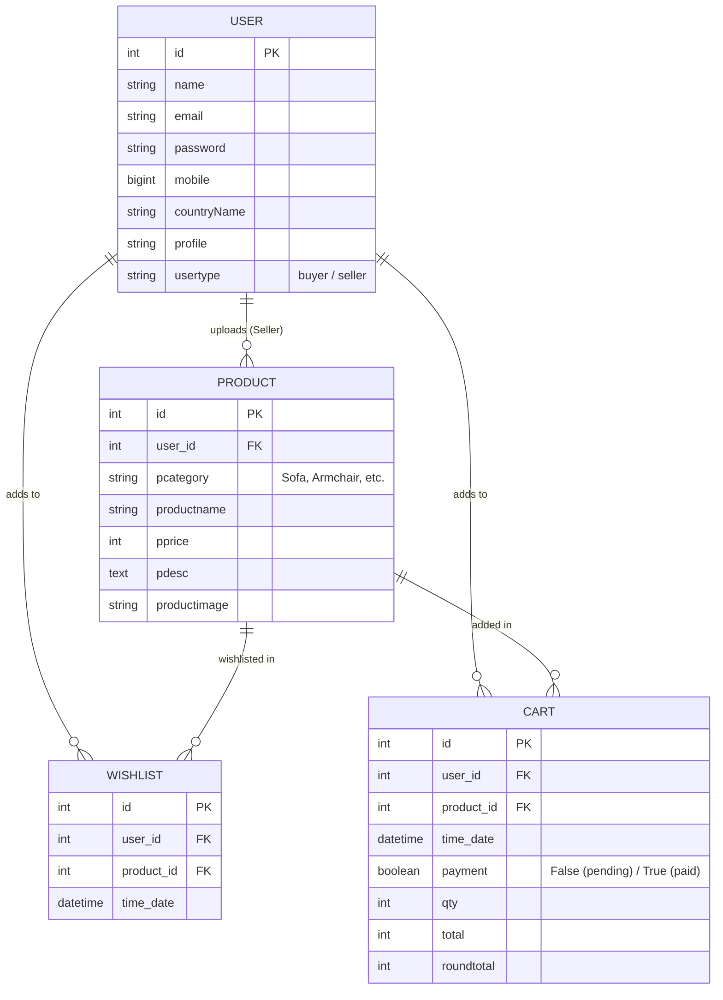

# Furni - Premium Django E-Commerce Furniture Store

[](https://docs.djangoproject.com/en/5.0/)
[](https://www.python.org/)
[](#)

Furni is a state-of-the-art, responsive Django-based e-commerce platform designed for browsing, buying, and selling premium furniture. The application features a robust two-sided portal architecture serving both **Buyers** and **Sellers**. Built with Python, Django, SQLite, Bootstrap, and integrated with the **Razorpay SDK** for secure payments and **Textbelt API** for OTP-based password retrieval, it provides a comprehensive end-to-end e-commerce experience.

---

## 🌟 Key Features

### 🛍️ Buyer Portal
*   **Dynamic Landing Page:** Features high-quality product showcases, interactive services, testimonials slider, and recent design blog posts.
*   **Product Catalog & Shop:** Filter and explore products by category (Sofa, Coffee Table, TV Stand, Armchair, Bookshelf, etc.).
*   **Interactive Wishlist:** Add and remove items to/from wishlist to save for later.
*   **Robust Shopping Cart:** Add items, dynamically adjust quantities with automatic total recalculations (via AJAX), and remove products.
*   **Secure Payment Checkout:** Full checkout module integrated with the **Razorpay Payment Gateway** for fast, secure digital transactions.
*   **Order Confirmation & History:** Track historical orders with success confirmations (`payment=True`) and browse previous purchases on the "My Orders" screen.
*   **Account Security:** Signup with profile picture upload, secure login, change password, and SMS OTP verification for password resets.

### 💼 Seller Portal
*   **Seller Dashboard:** Customized backend dashboard for manage listings.
*   **Inventory Control:** Add new products, configure price, categories, description, and upload product images.
*   **Product Management:** View uploaded products, view details, update product attributes, or delete listings from the inventory.
*   **Profile Management:** Update seller credentials and upload/change profiles.

---

## 🛠️ Technology Stack

*   **Backend Framework:** Django 5.0.6 (Python)
*   **Frontend UI:** HTML5, CSS3, SCSS, JavaScript (ES6+), Bootstrap, Tiny-Slider (for testimonial animations)
*   **Database:** SQLite3 (development)
*   **Payment Gateway:** Razorpay API (Client SDK and backend order verification)
*   **OTP SMS Gateway:** Textbelt API
*   **Authentication & Security:** Custom Session Timeout Middleware (`django-session-timeout`) for secure session auto-expiry.

---

## 📂 Project Architecture

The workspace is organized into a clean Django structure, separating settings, app logic, static files, and uploaded media.

```text
Furni/
├── README.md               # Project documentation
├── requirements.txt         # Project dependencies
├── myenv/                  # Python Virtual Environment (pre-configured)
└── myenv/myproject/        # Django Project Directory
    ├── manage.py           # Django CLI command utility
    ├── db.sqlite3          # SQLite Database File
    ├── myproject/          # Project Core Settings & Configurations
    │   ├── __init__.py
    │   ├── asgi.py
    │   ├── settings.py     # Main configuration (Apps, Middleware, DB, Razorpay Keys)
    │   ├── urls.py         # Root URL routing (Includes myapp.urls)
    │   └── wsgi.py
    ├── myapp/              # Main E-Commerce Application App
    │   ├── __init__.py
    │   ├── admin.py        # Django Admin registrations
    │   ├── apps.py
    │   ├── models.py       # DB Schemas (User, Product, Wishlist, Cart)
    │   ├── tests.py
    │   ├── urls.py         # App URL Routing (Auth, Cart, Wishlist, Checkout, Seller routes)
    │   ├── views.py        # Business logic for buyer/seller portals
    │   ├── static/         # Frontend Assets
    │   │   ├── css/        # Stylesheets (Bootstrap, Custom styles)
    │   │   ├── js/         # Custom Scripts (Bootstrap, custom.js, tiny-slider.js)
    │   │   ├── scss/       # SCSS styles
    │   │   └── images/     # Assets, SVG vectors, product default assets
    │   └── templates/      # Buyer & Seller HTML template pages
    └── media/              # User uploads (profile pictures & product images)
        └── picture/
            └── pimages/    # Directory holding uploaded product photos
```

---

## 💾 Database Schema & Models

The database structure is designed to handle relational associations between users, their inventory, wishlist, and cart items.



### 1. User Model
Stores user details, profile pictures, and handles portal redirection depending on the `usertype` (buyer vs. seller).
*   `name`: CharField (max_length=20)
*   `email`: EmailField
*   `password`: CharField (max_length=20)
*   `mobile`: BigIntegerField
*   `countryName`: CharField (max_length=20)
*   `profile`: ImageField (upload directory: `picture/`)
*   `usertype`: CharField (default: `"buyer"`)

### 2. Product Model
Stores product listings uploaded by sellers. Categories include standard residential and office furniture choices.
*   `user`: ForeignKey pointing to `User` (on_delete=CASCADE)
*   `pcategory`: CharField (choices: Sofa, Coffee Table, TV Stand, Armchair, Bookshelf, Bed Frame, Mattress, Mirror, Dining Table, Sideboard, Server Table, Dining Chairs)
*   `productname`: CharField (max_length=50)
*   `pprice`: PositiveIntegerField
*   `pdesc`: TextField
*   `productimage`: ImageField (upload directory: `picture/pimages`)

### 3. Wishlist Model
Relational link mapping buyer users to their favorited items.
*   `user`: ForeignKey pointing to `User`
*   `product`: ForeignKey pointing to `Product`
*   `time_date`: DateTimeField (default: `timezone.now`)

### 4. Cart Model
Handles cart items, billing updates, and transaction flag updating.
*   `user`: ForeignKey pointing to `User`
*   `product`: ForeignKey pointing to `Product`
*   `time_date`: DateTimeField (default: `timezone.now`)
*   `payment`: BooleanField (default: `False`, updates to `True` upon successful Razorpay capture)
*   `qty`: IntegerField (default: `1`)
*   `total`: IntegerField (individual unit price)
*   `roundtotal`: IntegerField (aggregated price: `total * qty`)

---

## ⚙️ Project Settings & Configurations

Key configurations established in `myproject/settings.py` include:

1.  **Session Timeout Middleware:**
    The application utilizes `django_session_timeout.middleware.SessionTimeoutMiddleware` to auto-expire user login sessions:
    ```python
    SESSION_EXPIRE_SECONDS = 3600   # 1 hour
    SESSION_EXPIRE_AFTER_LAST_ACTIVITY = True
    SESSION_TIMEOUT_REDIRECT = 'your_redirect_url_here/'
    ```
2.  **Media Upload Directories:**
    ```python
    MEDIA_ROOT = os.path.join(BASE_DIR, 'media')
    MEDIA_URL = '/media/'
    ```
3.  **Razorpay Gateway Keys:**
    ```python
    RAZORPAY_KEY_ID = 'rzp_test_qR4RRcX7iYEtFH'
    RAZORPAY_KEY_SECRET = 'lWVI4f7rnhwRhYSunmR3JDl6'
    ```

---

## 🚀 Installation & Setup

Follow these instructions to run the Furni application locally on your machine.

### Prerequisites
*   Python 3.12 or higher installed.
*   Virtual environment tool `venv` or `virtualenv`.

### Step 1: Clone and Navigate
Clone this repository and go to the project directory:
```bash
git clone <repository_url>
cd Furni
```

### Step 2: Set Up Python Virtual Environment
Initialize a fresh virtual environment matching your operating system (do not use the Windows-compiled `myenv` folder on macOS/Linux):

*   **macOS / Linux:**
    ```bash
    python3 -m venv venv
    source venv/bin/activate
    ```
*   **Windows:**
    ```bash
    python -m venv venv
    venv\Scripts\activate
    ```

### Step 3: Install Dependencies
Install all required libraries specified in `requirements.txt`:
```bash
pip install -r Furni/requirements.txt
```

### Step 4: Run Database Migrations
Create and execute migrations to generate the SQLite database layout:
```bash
cd Furni/myenv/myproject
python manage.py makemigrations
python manage.py migrate
```

### Step 5: Start the Development Server
Launch the Django server:
```bash
python manage.py runserver
```
Visit the app in your browser at `http://127.0.0.1:8000/`.

---

## 💳 Payment & SMS Integrations

### Razorpay Integration Workflow
1.  **Order Creation:** When a buyer opens the Cart, the backend dynamically initializes a Razorpay client order based on the computed cart totals:
    ```python
    client = razorpay.Client(auth=(settings.RAZORPAY_KEY_ID, settings.RAZORPAY_KEY_SECRET))
    payment = client.order.create({'amount': net * 100, 'currency': 'INR', 'payment_capture': 1})
    ```
2.  **Capture Payment:** The frontend executes the Razorpay modal for payment processing.
3.  **Post-payment:** On redirecting to `/thankyou`, the backend updates all associated cart items to `payment = True` so they appear under the user's Order History.

### SMS OTP Integration
ForgotPassword functionality requests verification using the Textbelt free/premium REST API:
```python
resp = requests.post('https://textbelt.com/text', {
    'mobile': str(mobile),
    'message': otp,
    'key': 'textbelt',
})
```

---

## ✉️ Contact
For feedback, questions, or assistance setting up, feel free to reach out:
*   **Maintainer:** Ketan Pillai
*   **Email:** ketanpillai@gmail.com
